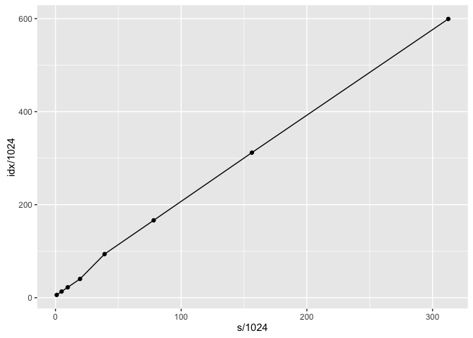

# Untitled
O. Denas  
November 20, 2016  

## R Markdown

Testing space usage on subsets of the `proteins.50MB` dataset from Pizza&Chilli. 

Below is space usage in bytes as a function of length of `s`. The quantity `idx` includes : the bwt of `s`, the tree topology of `s`, and rank/select indexes on the `runs` vector.

prefix                         t        s   vec      idx
-------------------------  -----  -------  ----  -------
proteins.50MB1000_1000      1000     1000   400     6100
proteins.50MB1000_10000     1000    10000   400    22895
proteins.50MB1000_160000    1000   160000   400   319388
proteins.50MB1000_20000     1000    20000   400    41332
proteins.50MB1000_320000    1000   320000   400   613747
proteins.50MB1000_40000     1000    40000   400    96125
proteins.50MB1000_5000      1000     5000   400    13625
proteins.50MB1000_80000     1000    80000   400   170384

<!-- -->

